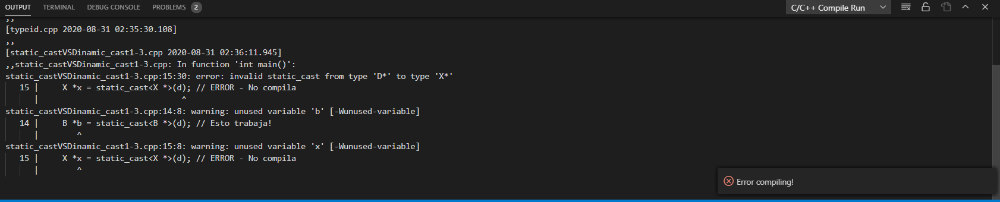

# Ejemplo de static_cast vs dynamic_cast

## :copyright: Autor

- :camera: 

- :joy: **Jamil André García Meléndez**
- :e-mail: garciajamil69@gmail.com
- :link: https://github.com/JamilGarcia
- :calendar: 2020-08-30 19:12

---

## :dart: Objetivos

---

## :black_circle: Funciones Virtuales

---

## :triangular_ruler: Sobrecarga 1

---

## :white_large_square: Sobrecarga 2

## :white_medium_square: Static_castVSDinamic_cast1-3

---

## :large_blue_diamond: Static_castVSDinamic_cast2-3

## :small_blue_diamond: Static_castVSDinamic_cast3-3

---

## :large_orange_diamond: Typeid

---
#### Herramientas:
- :package: [Visual Studio Code](https://code.visualstudio.com/)
- :camera: [Polacode-2020 v0.5.2](https://github.com/jeff-hykin/polacode)
- :notebook: [Markdown Cheatsheet](https://github.com/adam-p/markdown-here/wiki/Markdown-Cheatsheet)
- :smile: [Emoji Cheat Sheet](https://www.webfx.com/tools/emoji-cheat-sheet/)